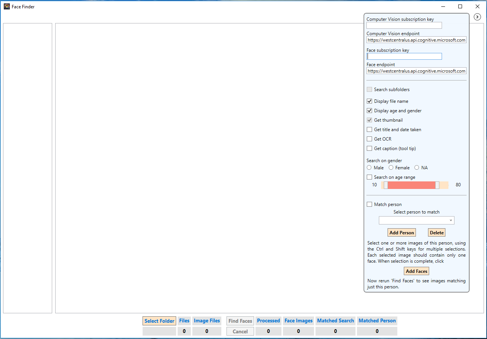
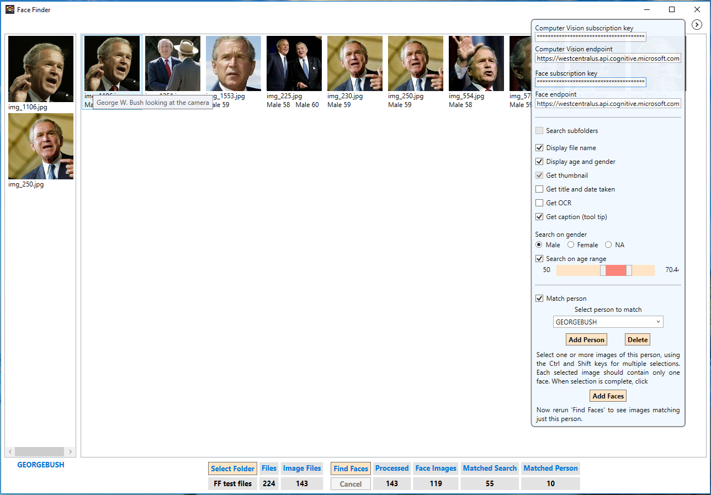

# Help for Face Finder

Face Finder provides two modes of operation. One is a search of a folder for images that contain at least one face. Basic searches can be filtered by age and gender.

To start:

1. Click the expander button on the top right of the screen.
1. Enter your Computer Vision and Face keys in the appropriate text boxes.
1. Click **Select Folder** and select a folder containing images that you want to search for faces.
1. Click **Find Faces**. If you want to stop the search early, click  **Cancel**.

Note: A subfolder named *FaceThumbnails* is created in the selected folder to store the thumbnails created by the Computer Vision service.

The following screenshot shows a search for males between the ages of 50 and 70.

The second mode of operation additionally filters the results to those images with a face that matches a specified person.

To filter by person:

1. Select the **Match person** checkbox.
1. Type a name for the person in the combo box and click **Add Person**.
1. Select one or more images of this person, using the Ctrl and Shift keys for multiple selections. Each selected image should contain only one face and that face should be a view showing both eyes.
1. When selection is complete, click **Add Faces**. The selected images appear in the left pane.
1. Click **Find Faces** to start the search over again.

A person and their associated images are persisted. To delete a person:

1. Select the person in the combo box.
1. Click **Delete**. A confirmation dialog appears for approval.

Note: After selecting a different person and then returning to a previous person, images associated with the previous person aren't displayed. However, the images are still used for matching.

Images in these screenshots are from [Labeled Faces in the Wild](http://vis-www.cs.umass.edu/lfw/).